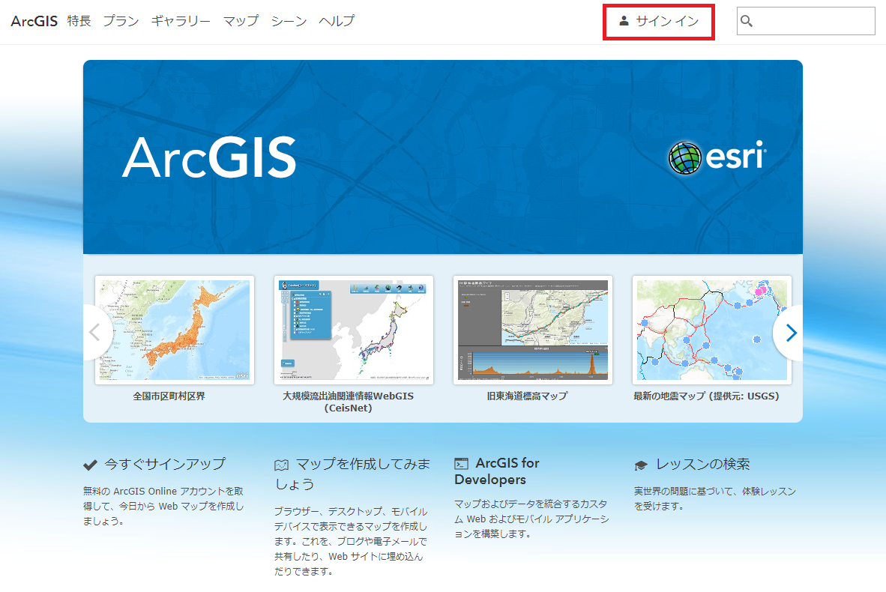

# ArcGIS API for JavaScript を使用した Web アプリ開発手順書

## Web アプリ

この手順書では、避難場所を可視化した Web マップを ArcGIS API for JavaScript を使用したアプリで読み込みます。  
さらに、ArcGIS Online の最寄り施設解析サービスを利用して、マップをクリックした地点から最寄りの避難場所を解析する機能を実装します。

## 1. Web マップの作成

ArcGIS for Developers へサインアップすると、作成されるポータルサイトへサインインし、[Web マップ](https://www.esrij.com/gis-guide/web-gis/web-map/)を作成します。

### 1. ポータルサイトへのアクセス

[ポータルサイト](https://www.arcgis.com/home/)へアクセスし、ArcGIS for Developers へサインアップした際に設定したユーザー名とパスワードを入力してサイン インします。  
[マップ] をクリックして、マップビューアーを開きます。

### 2. Web マップの作成

マップビューアーを使用して、アプリで利用する Web マップを構築します。

#### データの入手

Web マップで使用するデータを入手します。
今回は、室蘭市がオープンデータとして公開している避難場所データを使用します。  
[ESRIジャパン オープンデータポータル](http://data.esrij.com/) へアクセスし、[避難場所データ](http://data.esrij.com/datasets/muroran::避難場所)を検索します。  

避難場所データは、ArcGIS Online にホストされているため、独自にサービスを公開する必要はありません。  
[ジオサービスの URL](https://services.arcgis.com/Jv1EECU3IM4ZRUev/arcgis/rest/services/Muroran_Hinanbasyo/FeatureServer/0) をコピーします。

#### データの追加

Web マップに、避難場所データを表示します。  
マップビューアーを開き、[追加] をクリックします。[Web からレイヤーを追加] を選択し、コピーしたサービスの URL を入力します。  
Web マップに避難場所データがレイヤーとして追加されました。

#### スタイルの変更

追加した避難場所データのスタイルを変更します。  
マップビューアーにはスマートマッピングと呼ばれる、マップ上で表現したい属性を指定するだけで、シンボルの大きさや、色、表示縮尺、分類の閾値などが自動で設定され、その属性の内容（文字列、実数、整数等）に応じて適した表現方法を提示する機能が提供されています。
[コンテンツ] から避難場所レイヤーの [スタイルの変更]をクリックします。[表示する属性を選択] から「収容人数」を選択します。収容人数に含まれる値をもとに最適な表現方法が自動で設定されます。
また、必要に応じて、[オプション] から、色やサイズ、閾値、クラス分け、透過率などを手動で設定することも可能です。

スマートマッピングでは、色と大きさを使用して、複数のスタイルを設定することもできます。  
「収容人数」に加えて、「屋内屋外」も表現してみましょう。[属性の追加] から「屋内屋外」を選択します。避難場所の収容人数はシンボルの大きさで、避難場所の種類（屋内か屋外か）はシンボルの色で表現されます。  
[完了] をクリックし、スタイルの設定を終了します。

マップビューアーには、スタイルを変更するほかに、ポップアップを構成したり、フィーチャをフィルタリングしたり、ベースマップを変更したりといった様々な機能が提供されており、簡単に Web マップを構成することができます。

以下の項目を設定してみましょう。

* レイヤー
  * レイヤーの名前を「室蘭市 - 避難場所」に変更します。
  * ポップアップに以下の属性フィールドを表示するよう構成します。
    * 施設名称、住所、施設電話番、施設分類、屋内屋外、広域一時、津波避難所、建築年、構造、収容人数
* ベースマップ
  * 道路地図に設定します。

#### マップの保存

作成した Web マップを保存します。  
[マップの保存] をクリックして [保存] を選択します。任意のタイトル、タグ、サマリー、保存先のフォルダーを選択し [マップの保存] をクリックします。

Web マップを保存すると Web マップ ID とよばれる一意の ID が作成されます。Web マップ ID は URL から確認できます。Web マップ ID は、アプリから Web マップを参照する際に使用します。

## 2. Web アプリの作成

GitHub に公開している[ハンズオンのリポジトリ]()からサンプルをダウンロードします。

[https://github.com/EsriJapan/hogehoge/](https://github.com/EsriJapan/hogehoge/)

hands-on フォルダーにある index.html をテキストエディターで開きます。  
コメントに沿って以下の機能を実装していきます。
* Web マップの読み込み・表示
* Web マップに含まれる避難場所レイヤーの取得
* 最寄りの避難場所の検索
